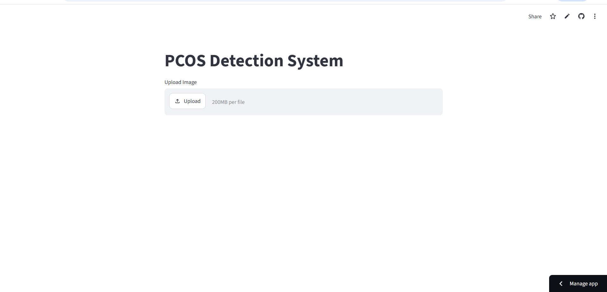
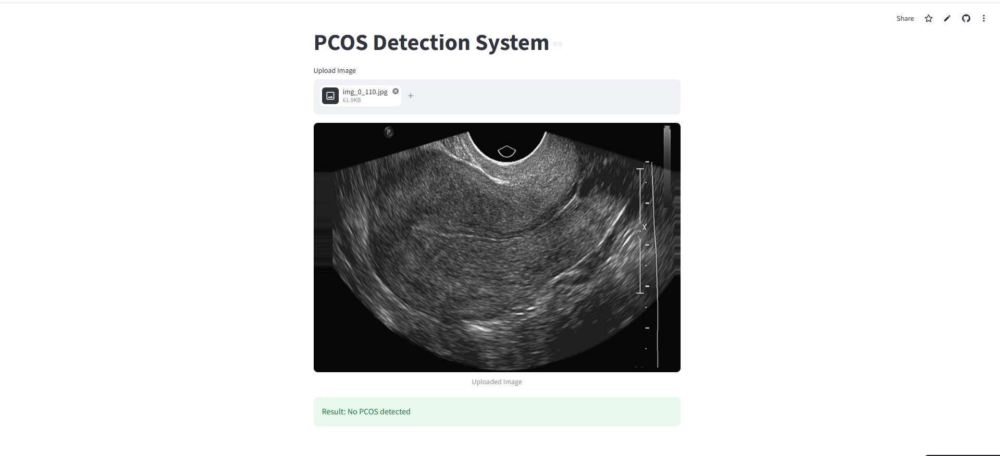

# 🩺 PCOS Detection using CNN (Streamlit Web App)

A Machine Learning-based web application that detects PCOS (Polycystic Ovary Syndrome) using a Convolutional Neural Network (CNN).  
The project is deployed using Streamlit and provides a simple interface for image upload and prediction.

---

## 🚀 Live Demo
👉 https://pcos-detection-using-cnn-vsjdyepydj6bvekxnvsk9k.streamlit.app/

---

## 📸 UI Preview

### 🏠 Home Page

### 📊 Prediction Result

---

## 🎯 Project Objective

The objective of this project is to build an end-to-end machine learning system that:
- Processes medical images
- Uses CNN-based model for prediction
- Provides a simple web interface using Streamlit
- Demonstrates deployment of ML model in real-world scenario

---

## 🧠 Features

- Upload medical images for prediction
- CNN-based deep learning model
- Real-time inference
- Simple and interactive Streamlit UI
- Cloud deployable web app

---

## 🛠 Tech Stack

- Python
- TensorFlow / Keras
- CNN (Deep Learning)
- Streamlit
- NumPy
- OpenCV
- Pillow

---

## 📂 Project Structure

PCOS-Detection-using-CNN/
│
├── assets/
│ ├── home.png
│ └── result.png
│
├── dataset/
│ └── README.txt
│
├── model/
│ └── cnn_model.h5
│
├── app.py
├── train_model.py
├── requirements.txt
├── runtime.txt
└── README.md

---

## ⚙️ Installation & Setup

### 1️⃣ Clone the repository
git clone https://github.com/your-username/pcos-detection-using-cnn.git
cd pcos-detection-using-cnn
### 2️⃣ Install dependencies
pip install -r requirements.txt
### 3️⃣ Run the application
streamlit run app.py
🧠 How It Works
User uploads a medical image
Image is preprocessed using OpenCV / Pillow
CNN model processes the image
Prediction is displayed on Streamlit UI
📦 Dataset

The dataset is not included in this repository due to size limitations.
However, the training pipeline is available in train_model.py.

📈 Future Improvements
Improve CNN model accuracy with larger dataset
Add Grad-CAM for model explainability
Deploy backend API for scalable inference
Enhance UI/UX for better user experience
👩‍💻 Author

Muskan Shaikh

📧 Email: shaikhmuskan2771@gmail.com
💼 LinkedIn: linkedin.com/in/musu-shaikh
💻 GitHub: github.com/Muskan2771
⭐ For Recruiters / HR

This project demonstrates:

End-to-end Machine Learning workflow
CNN-based image classification
Streamlit web application development
Model deployment on cloud platform
Practical understanding of AI/ML pipeline
🚀 Note

This project is part of my Machine Learning portfolio, focused on real-world deployment and practical AI application development.
